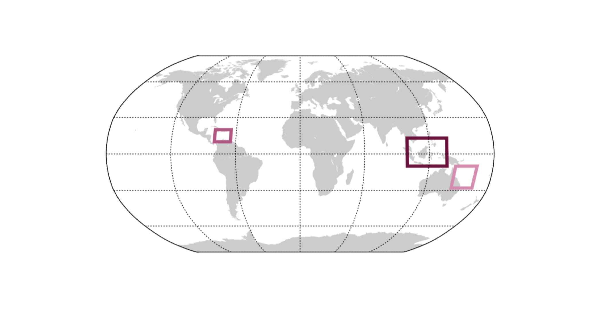

# General description

A trait-based model of coral-algae symbiosis to study coral acclimation under different warming scenarios. The model is applied to three coral reef ecosystems of the Tropics: the Great Barrier Reef, the South East Asia, and the Caribbean. Coral growth is constrained by thermal tolerance curves and corals respond to changing environmental conditions via plastic phenotypic changes.

Acclimation is captured by assuming that the temporal dynamics of a physiological trait, reflecting the energy that corals invest in the symbiotic relationship, is proportional to the gradient of coral fitness (assumed equal to net coral growth). The constant of proportionality reflects the speed of coral acclimation, i.e. the speed with which corals move towards an optimal trait value, one that maximises fitness, under changing environmental temperature. 

# Technicalities

The python code `Model-RCP-ode-monthly.py` produces times series of coral biomass, coral energy investment trait and symbiont biomass. 

The simulation takes as input several parameters (which are defined within code) and are forced by time-series of monthly temperature scenarios from input files of the type `.dat`.

The time-series for monthly temperature are included in this repository (`Monthly-SST-scenario.zip`), the file should be unzipped and placed in the same directory of the model. 

The model includes the process of bleaching (i.e. the expulsion of algae by the corals when the enviromenta temperature hits a certain threshold), which is parameterised according to literature data (listed in `S-density-bleaching.pdf`).

The results of the simulation are saved in folders, corresponding to the different scenarios, e.g. `Results/RCP26/`. These folders must be created prior to running the code. 
